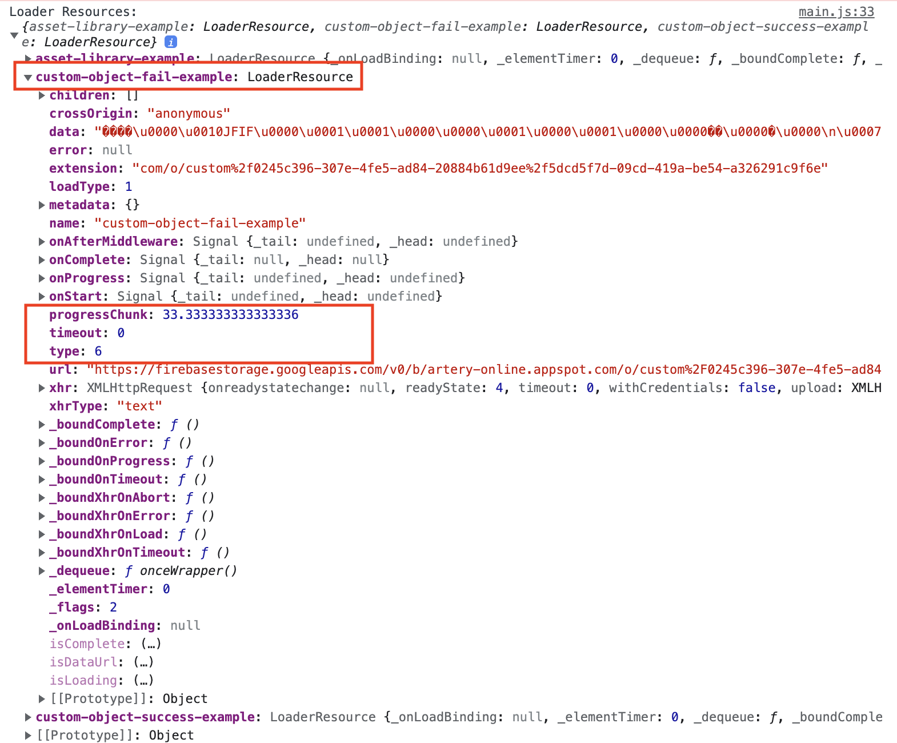
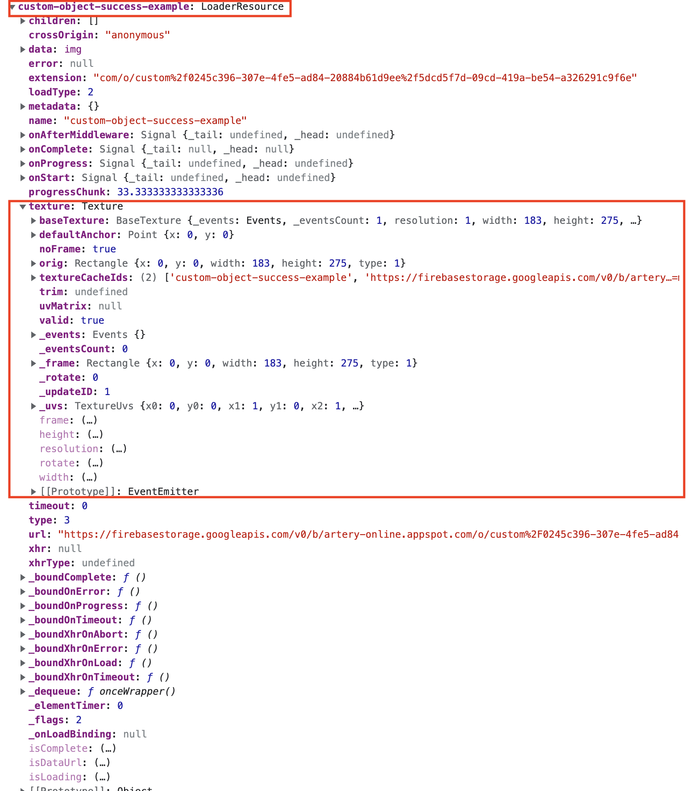

## Pixi Loader Test

This example uses two different URLs, one from the Assets Library and the other from the Custom Objects, in Firebase. The Firebase URL, when added to the loader without any options, will have no texture assigned to its Resource.

## How to test:

1. Load the `index.html` file in your browser. If you are using Visual Studio Code I suggest [Live Server](https://marketplace.visualstudio.com/items?itemName=ritwickdey.LiveServer).
2. Open the Console Log.
3. Take a look on the Loader Resources there.
4. The `custom-object-fail-example` will not have a `texture` assigned.
5. The `custom-object-success-example` will have a `texture` with its `textureCacheIds` assigned, since we explicitly informed the type here.

## Custom object without options:

As we can see in the image below, there is no `texture` property in here.

## Custom object with type options:

In this case we can see the `texture` property as expected.

